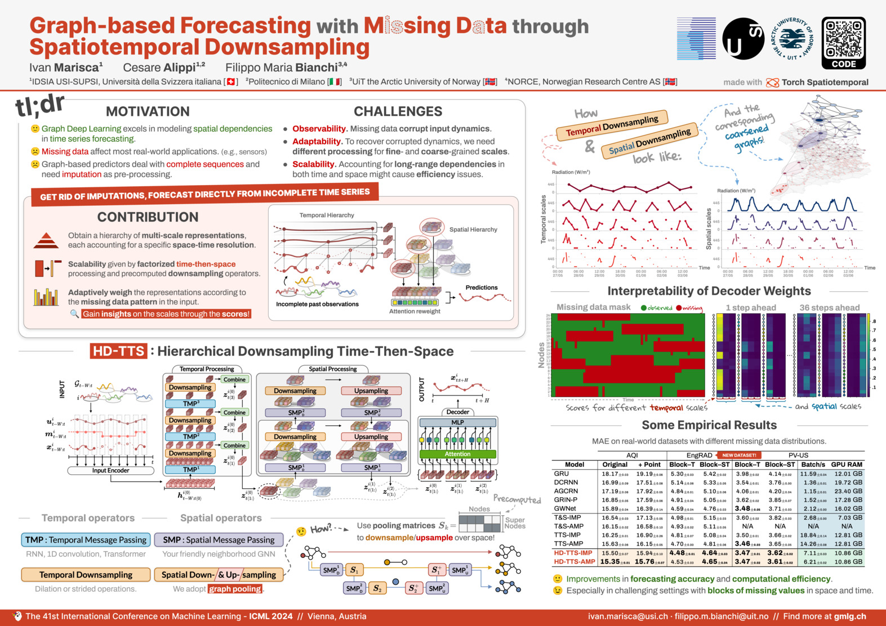

[]()
[](https://arxiv.org/abs/2402.10634)
[](docs/poster.pdf)

# HD-TTS

This folder contains the official code for the reproducibility of the
experiments presented in the paper "Graph-based Forecasting with Missing Data
through Spatiotemporal Downsampling" (ICML 2024). The paper proposes a
graph-based time series forecasting architecture that handles missing data by
computing representations at various spatiotemporal scales and adaptively
combining them to generate forecasts based on the missing data pattern.

**Authors**:
[Ivan Marisca](https://marshka.github.io/), 
[Cesare Alippi](https://alippi.faculty.polimi.it/), 
[Filippo Maria Bianchi](https://sites.google.com/view/filippombianchi/)

<div align=center>
	
</div>

---

## Directory structure

The code directory is structured as follows:

```
.
├── config/
├── lib/
├── conda_env.yaml
└── experiments/
    ├── run_mso.py
    └── run_realworld.py

```

## Datasets

In this paper, we introduce two new datasets: GraphMSO and EngRAD. In the
following, we provide instructions on how to download and use them.
The rest of the datasets used in the experiments are provided by the `tsl`
library.

### GraphMSO

The GraphMSO dataset is a synthetic dataset and is generated by the `GraphMSO`
class in `lib.datasets.mso.py`.
The dataset is generated on the fly and does not require any download. Please
refer to the class documentation for more details.

### EngRAD

[](https://doi.org/10.5281/zenodo.12760772)

The EngRAD dataset contains measurements of 5 different weather variables
collected at 487 grid points in England from 2018 to 2020.
The data has been provided by Open-Meteo and licensed under Attribution 4.0
International (CC BY 4.0).

The dataset is hosted on [Zenodo](https://zenodo.org/) and is downloaded
automatically by instantiating the class `EngRad` in `lib.datasets.engrad.py`.
Please refer to the class documentation for more details.

## Configuration files

The `config` directory stores all the configuration files used to run the
experiment using [Hydra](https://hydra.cc/).

## Requirements

To solve all dependencies, we recommend using Anaconda and the provided
environment configuration by running the command:

```bash
conda env create -f conda_env.yml
conda activate hd-tts
```

## Experiments

The scripts used for the experiments in the paper are in the `experiments`
folder.

* `run_mso.py` is used to train and evaluate models on the new GraphMSO dataset.
  As an example, to run HD-TTS-IMP on the point missing setting do:

  ```bash
  (hd-tts) $ python experiments/run_mso.py model=hd_tts_imp dataset=mso_point 
  ```

* `run_realworld.py` is used to train and evaluate models on the real-world
  benchmarks. As an example, to run HD-TTS-AMP on EngRAD (Block–ST) do:

  ```bash
  (hd-tts) $ python experiments/run_realworld.py model=hd_tts_amp dataset=engrad dataset/mode=block_st
  ```

## Citing

Please consider citing the paper if you find it useful for your research.

```latex
@article{marisca2024graph,
  title={Graph-based forecasting with missing data through spatiotemporal downsampling},
  author={Marisca, Ivan and Alippi, Cesare and Bianchi, Filippo Maria},
  journal={arXiv preprint arXiv:2402.10634},
  year={2024}
}
```